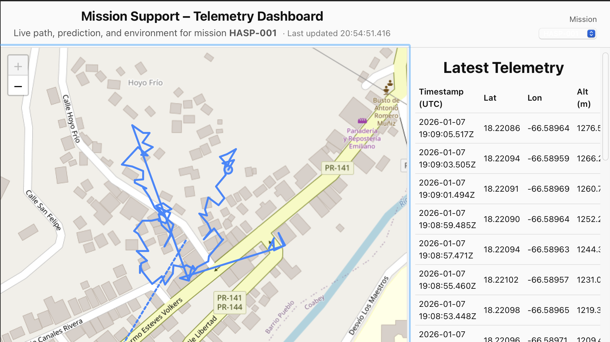
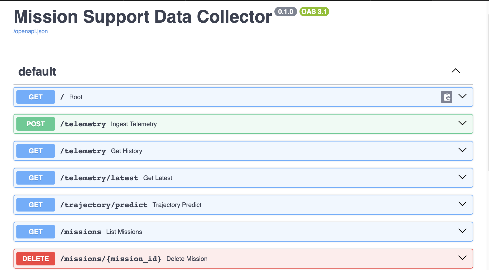

# Mission Support — Telemetry & Trajectory Dashboard

Mission Support is an end-to-end telemetry ingestion, storage, prediction, and visualization system designed for high-altitude balloon and mission-tracking scenarios.

The system receives live telemetry packets, validates and stores them by mission, performs short-term trajectory prediction, and visualizes both current and predicted paths on an interactive dashboard.

---

## Overview

**Mission Support** provides:

- A **FastAPI backend** for telemetry ingestion and querying
- **Persistent storage** using SQLAlchemy + SQLite
- **Mission-aware data handling** (`mission_id`)
- **Short-term trajectory prediction** with uncertainty modeling
- A **Vue + Leaflet dashboard** for real-time visualization
- A **telemetry simulator client** for end-to-end testing

The architecture is intentionally modular so prediction logic can later be replaced with machine-learning models without breaking API consumers.

---
## Tech Stack
### Backend
- FastAPI
- SQLAlchemy
- SQLite
- Pydantic
### Frontend
- Vue
- Vite
- Leaflet
### Infrastructure
- Docker
- Docker Compose
### Language
- Python
- JavaScript

## Key Features

### Telemetry Ingestion
- `POST /telemetry` endpoint
- Mission-scoped packets (`mission_id`)
- Validation:
  - coordinate bounds
  - timestamp freshness
  - NaN handling
  - sanity checks on optional fields
- Structured logging for debugging and observability

### Persistent Storage
- SQLAlchemy ORM
- SQLite database (local development)
- Mission-filtered queries
- Designed to migrate easily to PostgreSQL

### Trajectory Prediction (Experimental)
- Short-term prediction using recent velocity estimation
- Uncertainty radius grows with time
- Reliable for **seconds to minutes**
- Explicitly documented limitations

> Long-term balloon trajectory prediction is chaotic due to wind shear and atmospheric layers.  
> This predictor is intentionally conservative and designed to be replaced by ML models in the future.

### Dashboard (Vue + Leaflet)
- Live telemetry path
- Predicted trajectory (dashed line)
- Mission selector dropdown
- Latest telemetry table
- Environment panels:
  - temperature
  - pressure
  - humidity

### Telemetry Simulator
- Python client that generates realistic mission packets
- Used for testing ingestion, storage, prediction, and UI
- Can be replaced later by real balloon hardware packets

---

## Project Structure

```text
mission_support/
├── backend/
│   ├── app/
│   │   ├── api/                # FastAPI routes
│   │   ├── services/           # telemetry & trajectory logic
│   │   ├── storage/            # DB access layer
│   │   ├── db.py               # SQLAlchemy session
│   │   ├── db_models.py        # ORM models
│   │   ├── main.py             # FastAPI app
│   │   ├── models.py           # Pydantic schemas
│   │   └── clients.py/          # telemetry simulator
│   └── requirements.txt
│
├── frontend/
│   ├── src/                    # Vue components
│   ├── public/
│   ├── package.json
│   └── vite.config.js
│
├── README.md
└── .gitignore
```

## Docker Setup
From Project Root:
```bash
docker compose up --build
```
### Services available at:
Backend Api:
```bash
http://127.0.0.1:8000
```
Interactive API docs
```bash
http://127.0.0.1:8000/docs
```
Frontend Dashboard
```bash
http://127.0.0.1:5173
```

## Backend Setup Without Docker
```bash
cd backend
python -m venv .venv
source .venv/bin/activate
pip install -r requirements.txt
uvicorn app.main:app --reload
```
### Backend Available at:
```cpp
http://127.0.0.1:8000
```
### Interactive API docs:
```cpp
http://127.0.0.1:8000/docs
```
## Frontend Setup Without Docker
```bash
cd frontend
npm install
npm run dev
```
### Dashboard Available at:
```cpp
http://127.0.0.1:5173
```

## Telemetry Packet Example
```json
{
  "mission_id": "HASP-001",
  "timestamp": "2026-01-07T21:14:52Z",
  "lat": 18.2105,
  "lon": -66.0498,
  "altitude_m": 14250.3,
  "temperature_c": -12.4,
  "pressure_hpa": 890.3,
  "humidity_pct": 32.0
}
```

## Trajectory Prediction Notes
The current trajectory predictor:
- Uses recent telemetry velocity estimation
- Assumes smooth motion over short horizons
- Is not intended for long-term prediction

Future plans include:
- ML-based trajectory prediction trained on historical missions
- Hybrid physics + ML models
- Integration with atmospheric wind data

## Additional Future Features
### Reliability:
- PostgreSQL support for production deployments
- Background workers for ingestion and prediction (Celery / FastAPI BackgroundTasks)
- API rate limiting and authentication (API keys)
### Data:
- CSV / Parquet export per mission
- Mission replay mode (playback historical telemetry)
- Basic anomaly detection (sudden drops, sensor failures)
### Frontend:
- Mission timeline scrubber
- Alert system (low battery, rapid descent)
- Multi-mission comparison view
### Deployment:
- Dockerized backend + frontend
- Cloud deployment

## Purpose
This project is part of a mission-support toolkit focused on learning: backend engineering, telemetry pipelines, API validation & logging, SQL data modeling, Real-time visualization and Predictive system design 

## Preview
### Telemetry Dashboard

### FastAPI Interactive Docs


## Dev
Built and designed by John A. Cartegena Perez
Software Engineering student project focused on backend systems, telemetry, and mission support tooling.


